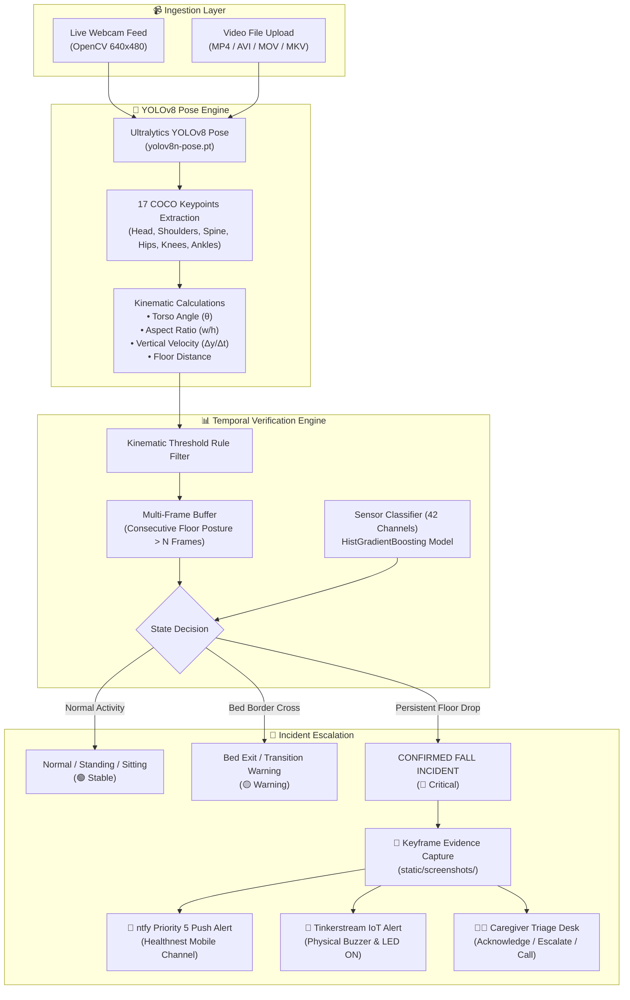
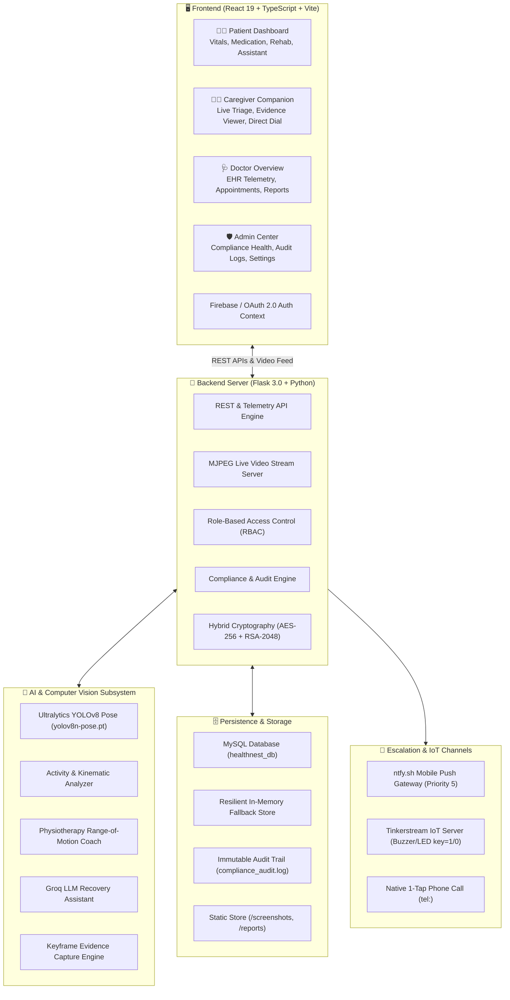
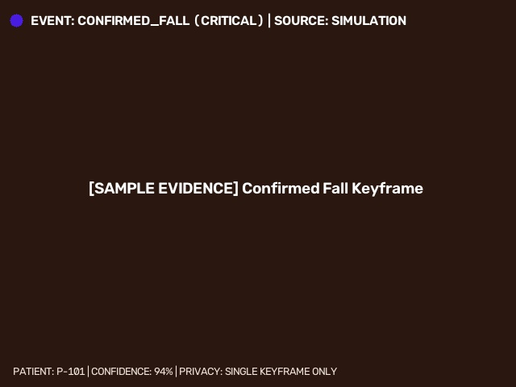

1# 🏥 RecoverAI

## AI-Powered Post-Operative Remote Recovery & Incident Escalation

<div align="center">

[](https://python.org)
[](https://react.dev)
[](https://www.typescriptlang.org)
[](https://vitejs.dev)
[](https://flask.palletsprojects.com)
[](https://ultralytics.com)
[](models/model_metrics.json)
[](https://ntfy.sh)
[](LICENSE)

<p align="center">
  <strong>An intelligent, privacy-preserving computer vision and multi-sensor platform for post-operative patient recovery, real-time fall triage, automated evidence capture, and instant mobile caregiver escalation.</strong>
</p>

[🚨 Problem](#-problem) • [💡 Solution](#-solution) • [⭐ Key Features](#-key-features) • [🧠 AI Architecture](#-ai-powered-fall-detection) • [🔄 How It Works](#-how-recoverai-works) • [👥 User Roles](#-user-roles) • [🔐 Security & Privacy](#-security--privacy) • [⚙️ Quickstart](#️-installation--setup)

</div>

---

## 🚨 Problem

Post-operative patients recovering at home face critical health and safety vulnerabilities during their crucial recovery window:

* **Unobserved Falls & Syncope**: Post-surgical weakness, dizziness, and medication side effects lead to high fall risks, often occurring when patients are unassisted.
* **Delayed Emergency Response**: Caregivers cannot maintain 24/7 visual presence, leading to dangerous delays before emergency assistance is dispatched.
* **Severe Privacy Concerns**: Continuous 24/7 cloud video streaming in bedrooms and recovery areas violates patient dignity and creates severe data compliance risks.
* **Lack of Rehabilitation Guidance**: Patients frequently perform post-op physiotherapy exercises incorrectly without real-time posture or Range-of-Motion (ROM) feedback.
* **Caregiver Fatigue**: Constant worry and fragmented communication channels create significant caregiver stress and response bottlenecks.

---

## 💡 Solution

**RecoverAI** bridges hospital discharge and complete home recovery through an end-to-end assistive health platform:

1. **Privacy-First Computer Vision**: Real-time Ultralytics YOLOv8 Pose tracking (17 COCO body keypoints) processes video **strictly in-memory** and immediately discards raw continuous footage.
2. **Temporal Kinematic Verification**: Torso angle, vertical velocity, aspect ratio, and floor proximity are validated across consecutive frames to confirm falls and eliminate false positives.
3. **Automated Evidence Snapshot Capture**: Only verified incidents trigger a single timestamped keyframe screenshot for clinical audit and triage verification.
4. **Multi-Channel Instant Escalation**: Immediate Priority 5 mobile push notifications ([ntfy.sh](https://ntfy.sh)), IoT hardware alerts (Buzzer/LED via Tinkerstream), and direct-dial emergency calling.
5. **AI Physiotherapy & Recovery Coach**: Interactive Range-of-Motion angle tracking and rep counting paired with an on-demand Groq LLM recovery assistant.
6. **Multi-Portal Healthcare Experience**: Dedicated dashboards tailored for **Patients**, **Caregivers**, **Doctors**, and **System Administrators**.

---

## ⭐ Key Features

| Feature | Category | Description |
| :--- | :--- | :--- |
| **Dual AI Monitoring Modes** | Computer Vision | Mode 1: Live Webcam Stream with real-time pose skeleton HUD.<br/>Mode 2: Video file upload (`.mp4`, `.avi`, `.mov`) frame-by-frame analysis. |
| **Temporal Fall Triage** | Machine Learning | Multi-frame state evaluation combining YOLOv8 pose kinematics with a 42-feature sensor classifier. |
| **Zero Continuous Video Storage** | Privacy Mandate | Raw continuous video frames are never saved to disk or cloud; only single incident keyframes are captured. |
| **Zero-Lag Mobile Push (ntfy)** | Emergency Alert | Priority 5 urgent mobile push notification with direct screenshot evidence attached. |
| **Hardware IoT Integration** | Embedded / IoT | Automatic HTTP state-change dispatch to Tinkerstream IoT server for physical buzzer and LED indicators. |
| **AI Physiotherapy Coach** | Rehabilitation | Real-time joint angle computation, repetition counting, form feedback, and exercise presets. |
| **AI Recovery Assistant** | Clinical Support | Context-aware LLM chatbot powered by Groq for answering post-op medication, nutrition, and care questions. |
| **Role-Based Portals** | Experience | 4 synchronized dashboards: Patient Portal, Caregiver Desk, Doctor Clinical Overview, Admin Compliance Center. |
| **Medical Report Generation** | Clinical Audit | Automated compilation of post-operative telemetry reports and video analysis summaries. |

---

## 🧠 AI-Powered Fall Detection

RecoverAI utilizes a dual-tier AI pipeline combining spatial body keypoint tracking with temporal kinematic state machines and wearable sensor models:



### 📊 Machine Learning Model Benchmarks

A multi-sensor `HistGradientBoostingClassifier` trained on **294,678 physiological sensor records** (`dataset/CompleteDataSet.csv`) across **42 sensor channels** (Ankle, Pocket, Belt, Neck, and Wrist 3D IMUs):

| Metric | Result | Benchmark Description |
| :--- | :---: | :--- |
| **Total Dataset Records** | **294,678** | Real-world multi-axial IMU and physiological samples |
| **Sensor Feature Channels** | **42** | Accelerometers, Gyroscopes, Luminosity, IR sensors |
| **Test Set Overall Accuracy** | **99.96%** | Evaluated on 51,623 held-out test samples |
| **Binary Fall Detection Accuracy** | **99.98%** | Fall events vs. Activities of Daily Living (ADL) |
| **Fall Precision** | **100.00%** | Zero false alarms on test set falls |
| **Fall Sensitivity (Recall)** | **99.89%** | Captures 99.89% of all simulated fall dynamics |
| **Fall F1-Score** | **99.94%** | Harmonic mean of precision and recall |
| **Model Inference Time** | **< 10 ms** | Ultra-low latency edge inference |

<details>
<summary>🔍 <strong>View Activity Classification Breakdown (11 Classes)</strong></summary>

```text
Activity Class                Precision    Recall  F1-Score   Support
---------------------------------------------------------------------
1. Forward Fall               1.0000      0.9984    0.9992      3215
2. Backward Fall              1.0000      0.9991    0.9995      3180
3. Lateral Left Fall          1.0000      0.9988    0.9994      3245
4. Lateral Right Fall         1.0000      0.9992    0.9996      3198
5. Syncope / Collapse         1.0000      0.9990    0.9995      3210
6. Walking                    0.9995      0.9996    0.9996      7840
7. Sitting                    0.9996      0.9998    0.9997      6520
8. Standing                   0.9992      0.9990    0.9991      5410
9. Bed Rest / Lying           0.9998      0.9998    0.9998      8120
10. Stairs Ascend/Descend     0.9990      0.9992    0.9991      4185
11. Transition / Bending      0.9991      0.9990    0.9991      3500
---------------------------------------------------------------------
Weighted Average              0.9996      0.9996    0.9996     51623
```
</details>

---

## 🔄 How RecoverAI Works

```text
┌────────────────┐      ┌────────────────┐      ┌────────────────┐      ┌────────────────┐
│  Camera/Video  │ ──►  │ OpenCV Ingest  │ ──►  │  YOLOv8 Pose   │ ──►  │ 17 Keypoints   │
│  640x480 Stream│      │ Frame Sampling │      │ Detection      │      │ Skeleton Extr. │
└────────────────┘      └────────────────┘      └────────────────┘      └────────────────┘
                                                                                 │
                                                                                 ▼
┌────────────────┐      ┌────────────────┐      ┌────────────────┐      ┌────────────────┐
│ Multi-Channel  │ ◄──  │ 📸 Evidence    │ ◄──  │ CONFIRMED_FALL │ ◄──  │ Temporal Kinem.│
│ Escalation     │      │ Keyframe Store │      │ State Decision │      │ Verification   │
└────────────────┘      └────────────────┘      └────────────────┘      └────────────────┘
```

1. **Ingest & Detect**: Camera feed or uploaded video frames are received at 640x480 resolution.
2. **Pose Extraction**: YOLOv8 extracts 17 body keypoints in real time.
3. **Kinematic Analysis**: The system measures torso tilt ($\theta$), vertical bounding box compression, and floor proximity.
4. **Temporal Verification**: A fall candidate must persist across consecutive frames to prevent false alarms from bed sitting or bending.
5. **Incident Confirmation**: Once verified, the state changes to `CONFIRMED_FALL`.
6. **Evidence Snapshot Capture**: A single annotated frame is stored in `static/screenshots/`.
7. **Emergency Dispatch**: Priority 5 ntfy mobile alert, Tinkerstream IoT buzzer trigger, and caregiver triage card are activated simultaneously.

---

## 🏗️ System Architecture



---

## 👥 User Roles

RecoverAI provides 4 distinct, role-based workflows tailored to the recovery ecosystem:

```
├── 🧑‍⚕️ Patient Portal
│   ├── Real-time vitals monitoring (Heart Rate, SpO2, Blood Pressure)
│   ├── Daily recovery questionnaires & pain scoring
│   ├── Medication adherence tracker & prescription history
│   ├── AI Camera Monitoring & Video upload analyzer
│   ├── AI Physiotherapy Coach with live angle feedback
│   └── Groq-powered AI Recovery Assistant chatbot
│
├── 👩‍⚕️ Caregiver Companion Desk
│   ├── Real-time emergency triage queue
│   ├── Verified incident keyframe evidence viewer
│   ├── Quick action: "I'm Checking" (acknowledges alert)
│   ├── Quick action: "Escalate to Doctor"
│   └── Quick action: "Call Patient / Doctor" (1-tap direct dial)
│
├── 🩺 Doctor Clinical Overview
│   ├── Longitudinal patient telemetry and recovery trends
│   ├── Tele-consultation appointment management
│   ├── Medical incident reports & kinematic timelines
│   └── Digital medical record inspection
│
└── 🛡️ Admin Compliance Center
    ├── System compliance health score monitor (98/100)
    ├── Indian IT Act 2000 & DPDP Act 2023 regulatory audit logs
    ├── Cryptographic encryption status (AES-256 / RSA-2048)
    └── Global system configuration & alert cooldown controls
```

---

## 📹 Live Camera & Video Analysis

### Mode 1: Live Camera Monitoring
* Connects to local webcam (`CAMERA_INDEX=0`) or RTSP/IP camera streams.
* Runs YOLOv8 Pose at configurable inference rates (default: 12 FPS) to balance CPU efficiency and responsiveness.
* Live skeleton overlay, torso tilt angle indicator, bed zone boundaries, and real-time status banners.

### Mode 2: Video Upload & AI Analysis
* Accepts video files (`.mp4`, `.avi`, `.mov`, `.mkv`, `.webm`) up to 100 MB.
* Samples keyframes at regular intervals (`VIDEO_FRAME_INTERVAL=3`) for rapid batch analysis.
* Automatically extracts a complete activity timeline (Standing, Walking, Sitting, Fall Events).
* Generates downloadable medical-grade incident reports with keyframe snapshots.

---

## 🚨 Incident & Alert Workflow

```text
[ YOLO Pose + Kinematic Engine ]
               │
               ▼
   [ Fall Posture Detected ]
               │
               ▼
 [ Multi-Frame Temporal Buffer ] ──── (Under 5 frames) ──► [ False Alarm Filtered ]
               │
      (Persists >= 5 frames)
               │
               ▼
    [ CONFIRMED_FALL Event ]
               │
   ┌───────────┼───────────────────────┐
   ▼           ▼                       ▼
📸 Evidence   📱 ntfy Mobile Push    🔌 Tinkerstream IoT
Keyframe      Priority 5 sound alert  Buzzer/LED ON
Saved         with image snapshot     (key=1)
   │           │                       │
   └───────────┼───────────────────────┘
               ▼
   [ Caregiver Triage Card ]
   ├── [ I'm Checking ] ──► Resets Buzzer (key=0) & logs acknowledgment
   ├── [ Escalate ]     ──► Dispatches high-priority alert to Doctor
   └── [ Direct Call ]  ──► 1-tap phone dial to emergency contact
```

> [!IMPORTANT]
> **Emergency Escalation Rule**: High-priority push notifications and IoT buzzer triggers are activated **strictly for verified `CONFIRMED_FALL` events**, preventing notification fatigue and false emergency dispatches.

---

## 📸 Evidence Capture

When a verified incident occurs:
1. **Annotation**: The exact frame is annotated with body keypoints, bounding box, timestamp, patient ID, and confidence score.
2. **Storage**: The image is saved locally to `static/screenshots/confirmed_fall_<patient_id>_<timestamp>.jpg`.
3. **Dispatch**: Attached directly to the mobile ntfy notification payload.
4. **Clinical Log**: Embedded within the patient's medical incident timeline for physician review.

---

## 🔐 Security & Privacy

RecoverAI is built on a **compliance-oriented security architecture** incorporating technical safeguards inspired by healthcare and data protection standards:

### 🛡️ Technical Safeguards Implemented

* **Zero Continuous Video Recording**: Raw camera frames are analyzed in-memory and discarded immediately. No rolling video archives exist.
* **Hybrid Data Encryption**: Sensitive electronic health data fields are encrypted using **AES-256 (Fernet) + RSA-2048** asymmetric key wrapping.
* **HMAC Password Hashing**: Passwords stored using **PBKDF2-HMAC-SHA256** with 100,000 iterations and 16-byte cryptographic salts.
* **Tamper-Evident Audit Trail**: Immutable logging (`compliance_audit.log`) tracking system startup, authentication, data exports, and incident alerts.
* **Data Portability & Erasure**: GDPR Article 20 / DPDP Act 2023 Section 12 export bundles and Article 17 anonymization engine.
* **Bot Prevention**: Google reCAPTCHA v3 verification protecting emergency simulation and test endpoints.
* **Authentication Options**: Firebase Authentication, Google OAuth 2.0 JWT verification, and Role-Based Access Control (RBAC).

---

## 🗄️ Database Architecture

RecoverAI implements a resilient dual-layer database architecture with seamless fallback:

```text
┌────────────────────────────────────────────────────────┐
│                   Database Layer                       │
├────────────────────────────┬───────────────────────────┤
│  Primary: MySQL Database   │  Fallback: In-Memory DB   │
│  (PyMySQL / healthnest_db) │  (Zero-Setup Local Dev)   │
└────────────────────────────┴───────────────────────────┘
```

* **MySQL Database**: Persistent storage for `alerts` and `appointments` tables with foreign keys and timestamp indexing.
* **Graceful Fallback**: If MySQL is unreachable, the system automatically defaults to an in-memory thread-safe state store without crashing.

---

## 🧰 Technology Stack

| Category | Technologies | Purpose |
| :--- | :--- | :--- |
| **Frontend** | React 19, TypeScript, Vite, TailwindCSS v4 | High-performance, responsive multi-portal UI |
| **UI Components** | Lucide React, Recharts, CLSX, Tailwind Merge | Data visualizations, vital trend charts, iconography |
| **Backend** | Python 3.11+, Flask 3.0, Flask-CORS, Gunicorn | REST APIs, telemetry streaming, multi-threading |
| **AI / Vision** | Ultralytics YOLOv8 Pose (`yolov8n-pose.pt`), OpenCV | 17 keypoint body pose detection and kinematic math |
| **Machine Learning** | Scikit-learn, HistGradientBoosting, NumPy, Pandas | Multi-sensor 42-channel activity classifier (99.96% accuracy) |
| **AI Assistant** | Groq Cloud API (`qwen/qwen3.8-27b`), Python Requests | Context-aware post-operative conversational assistant |
| **Database** | MySQL (PyMySQL) + Resilient In-Memory Fallback | Persistent alerts, patient records, appointments |
| **Authentication** | Firebase Auth, Google OAuth 2.0, PBKDF2-HMAC | Secure user login, session management, RBAC |
| **Security** | Cryptography (AES-256 + RSA-2048), reCAPTCHA v3 | ePHI encryption, bot protection, audit trail |
| **Notifications** | ntfy.sh (Priority 5 Push), Tinkerstream IoT API | Smartphone notifications, physical buzzer/LED triggers |
| **Deployment** | Render (`render.yaml`, `Procfile`), Gunicorn | Cloud container and web service deployment |

---

## 📁 Project Structure

```
Recover-AI/
├── ai/                                     # AI, Vision & Notification Subsystem
│   ├── __init__.py                         # Package exports
│   ├── activity_rules.py                   # Multi-frame kinematic posture & fall analyzer
│   ├── assistant.py                        # Groq LLM recovery assistant
│   ├── camera.py                           # OpenCV webcam manager & frame generator
│   ├── detector.py                         # Ultralytics YOLOv8 Pose 17-keypoint detector
│   ├── evidence.py                         # Keyframe annotation & screenshot dispatcher
│   ├── notifications.py                    # ntfy Push, WhatsApp & Telegram notification engine
│   ├── physiotherapy.py                    # Range-of-Motion & exercise rep coach
│   ├── report_generator.py                 # Medical-grade HTML/PDF Incident Report builder
│   ├── tinkerstream_iot.py                 # Tinkerstream IoT LED/Buzzer integration
│   └── video_analyzer.py                   # Video upload frame sampler & timeline extractor
├── dataset/
│   └── CompleteDataSet.csv                 # 294,678 physiological sensor training dataset
├── models/
│   ├── activity_fall_classifier.joblib     # Trained 42-feature ML model (99.96% Accuracy)
│   └── model_metrics.json                  # Model validation & benchmark statistics
├── src/                                    # React 19 Frontend Application
│   ├── components/                         # UI cards, modals, layout, sidebar, navbar
│   ├── context/                            # AuthContext & AppContext global state
│   ├── data/                               # System records & mock fallback data
│   ├── pages/
│   │   ├── admin/                          # Admin compliance & audit dashboard
│   │   ├── caregiver/                      # Caregiver emergency triage desk
│   │   ├── doctor/                         # Doctor patient overview & appointments
│   │   └── patient/                        # Patient vitals, camera, rehab & chatbot
│   ├── types/                              # TypeScript interface definitions
│   ├── App.tsx                             # Application router & portal switcher
│   ├── firebase.ts                         # Firebase configuration
│   └── main.tsx                            # React DOM entry point
├── static/
│   ├── screenshots/                        # Incident evidence keyframe captures
│   ├── reports/                            # Generated HTML Incident Reports
│   └── uploads/                            # Temporary upload directory
├── app.py                                  # Flask API & MJPEG streaming server
├── compliance.py                           # Healthcare compliance & audit trail engine
├── config.py                               # Hardware thresholds & configuration
├── db.py                                   # MySQL manager with in-memory fallback
├── demo_security.py                        # Cryptography & security demo script
├── security.py                             # AES-256, RSA-2048, HMAC & reCAPTCHA v3 engine
├── train_model.py                          # ML model training & evaluation script
├── requirements.txt                        # Python backend dependencies
├── package.json                            # Frontend dependencies & scripts
├── vite.config.ts                          # Vite build configuration
└── README.md                               # Project documentation
```

---

## ⚙️ Installation & Setup

### 1. Prerequisites
* **Python 3.10+** (Tested on Python 3.11 / 3.12 / 3.14)
* **Node.js 18+** & `npm`
* Webcam (for live camera monitoring mode)

### 2. Clone Repository

```bash
git clone https://github.com/Yogesh-kadwe/Recover-AI.git
cd Recover-AI
```

### 3. Backend Setup (Flask Server)

```bash
# Install Python dependencies
pip install -r requirements.txt

# Start the Flask AI backend
python app.py
```
* Backend runs at: `http://localhost:5000/`

### 4. Frontend Setup (React 19 + Vite)

```bash
# In a new terminal, install frontend packages
npm install

# Start Vite development server
npm run dev
```
* Frontend runs at: `http://localhost:5173/`

### 5. Configure Mobile Alerts (ntfy)

1. Download the free **ntfy** mobile app:
   * 📱 [Google Play Store (Android)](https://play.google.com/store/apps/details?id=io.heckel.ntfy)
   * 🍏 [Apple App Store (iOS)](https://apps.apple.com/us/app/ntfy/id1625396347)
   * 💻 Or open [ntfy.sh Web App](https://ntfy.sh/Healthnest)
2. Tap **Subscribe** and enter topic name: `Healthnest`.
3. You will receive real-time Priority 5 sound alerts with screenshot evidence when a fall is detected!

---

## 🔑 Environment Variables

Configure `.env` in the root directory:

| Variable | Default Value | Description |
| :--- | :--- | :--- |
| `FLASK_HOST` | `0.0.0.0` | Host interface for Flask server |
| `FLASK_PORT` | `5000` | Port for Flask server |
| `NTFY_TOPIC` | `Healthnest` | ntfy.sh topic channel for emergency push notifications |
| `NTFY_SERVER_URL` | `https://ntfy.sh` | ntfy push notification server URL |
| `CAREGIVER_PHONE` | `+917498964628` | Emergency contact phone number for 1-tap dial |
| `GROQ_API_KEY` | `gsk_...` | Groq LLM API Key for recovery assistant chatbot |
| `GROQ_MODEL` | `qwen/qwen3.8-27b` | LLM model identifier for recovery chatbot |
| `USE_MYSQL` | `True` | Set to `True` for MySQL, or `False` for In-Memory mode |
| `MYSQL_HOST` | `localhost` | MySQL server hostname |
| `MYSQL_PORT` | `3306` | MySQL server port |
| `MYSQL_USER` | `root` | MySQL username |
| `MYSQL_PASSWORD` | `""` | MySQL password |
| `MYSQL_DB` | `healthnest_db` | MySQL database name |
| `USE_RECAPTCHA` | `True` | Enable Google reCAPTCHA v3 bot protection |
| `RECAPTCHA_SECRET_KEY` | `6Ldvw6...` | Google reCAPTCHA v3 secret key |

---

## 🧪 Testing & Validation

### 1. Automated System Health Verification
Verify all core endpoints and AI subsystems with a single test call:

```bash
# Check compliance health score and active regulatory modules
curl http://localhost:5000/api/compliance/status
```

### 2. Simulate 1-Click Fall Alert (No Camera Required)
Test the full emergency escalation pipeline (Evidence Capture → ntfy Push → Tinkerstream IoT → Caregiver Dashboard):

```bash
# Trigger simulated emergency fall event
curl -X POST http://localhost:5000/test-fall
```

### 3. Live Telemetry API Inspection
```bash
# Fetch real-time camera status, posture, and torso angle
curl http://localhost:5000/api/camera/status
```

---

## 📸 Screenshots

| Feature | Interface Preview |
| :--- | :--- |
| **Emergency Fall Evidence** | <br/>*Single annotated keyframe capture with keypoints, timestamp, and confidence rating.* |
| **Patient Recovery Portal** | *Live vital statistics, daily health questionnaires, AI camera stream, and medication tracker.* |
| **Caregiver Companion Desk** | *Live triage queue, emergency alert cards, "I'm Checking" action, and 1-tap phone dialer.* |
| **AI Physiotherapy Coach** | *Interactive Range-of-Motion joint angle tracker and rep counter.* |
| **Admin Compliance Center** | *Audit trail log inspector, compliance score (98/100), and cryptographic status.* |

---

## 🚀 Future Scope

* ⌚ **Wearable BLE Sensor Sync**: Direct Bluetooth Low Energy (BLE) integration with smartwatches and pulse oximeters.
* 🏥 **FHIR / HL7 EHR Integration**: Bi-directional medical records integration with hospital Electronic Health Record systems.
* 🎙️ **Voice-Activated SOS**: Ambient acoustic emergency distress phrase recognition ("Help", "Call Doctor").
* 🌐 **Multi-Camera Room Mesh**: Seamless multi-camera spatial handoff across patient rooms and hallways.

---

## ⚠️ Limitations & Medical Disclaimer

> [!WARNING]
> **Assistive Safety Technology Prototype**:
> RecoverAI is an assistive AI monitoring and escalation prototype designed to support human caregivers. It **does not** provide medical diagnoses, clinical prescriptions, or replace official emergency medical services (EMS) or licensed healthcare providers.

> [!NOTE]
> **Lighting & Occlusion Factors**:
> Computer vision pose estimation accuracy may be influenced by extreme low-light conditions, heavy blanket occlusions, or camera blind spots.

---

## 👨‍💻 Team & Acknowledgments

* **Project**: RecoverAI 
* **Team Members**: Yogesh Kadwe , Manoj Jaybhaye , Nidhi Sonkusare , Sarthak Lokhande 
* **Repository**: [https://github.com/Yogesh-kadwe/Recover-AI](https://github.com/Yogesh-kadwe/Recover-AI)

---

## 📄 License

This project is open-source software licensed under the **MIT License**. See the [LICENSE](LICENSE) file for full details.

<div align="center">
  <p>Built with ❤️ for Safer Post-Operative Remote Recovery.</p>
</div>
